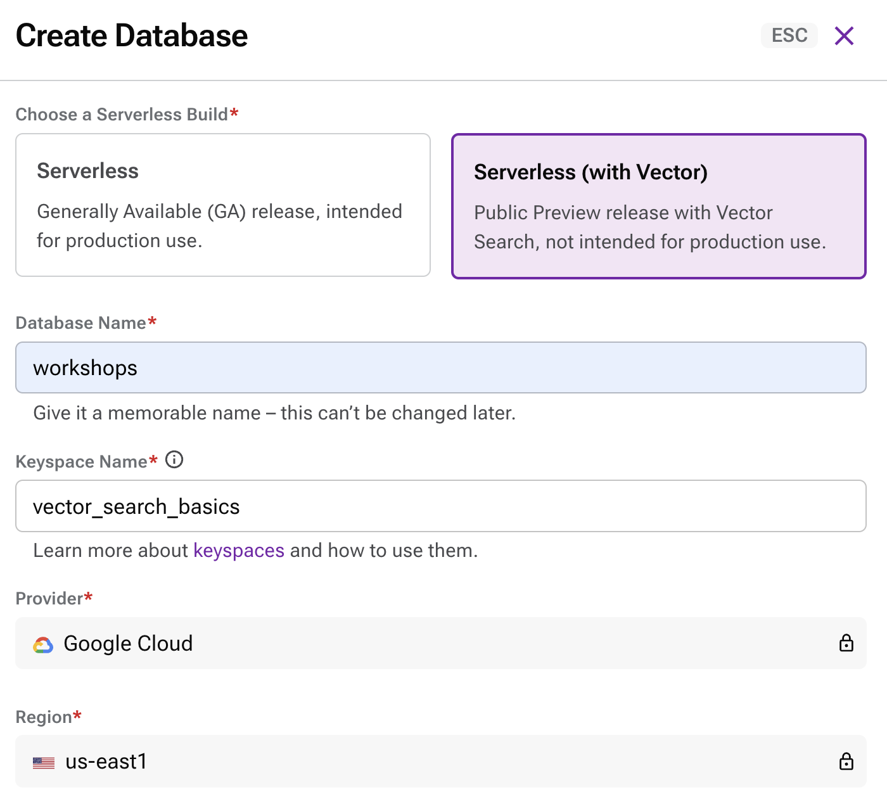
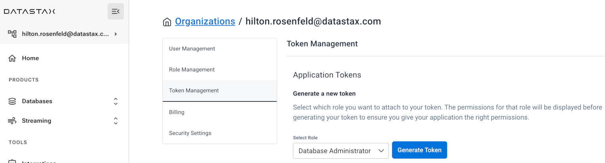

# Vector Search Basics

<br />

## Introduction

This demo requires an Astra account and an OpenAI account. 

Please ensure that you have an openAI API key.

## Step 1: Create a vector search enabled database in Astra

You will now create a database with a keyspace in it (a *keyspace* can contain tables).

Besides creating the database, you need to retrieve a *token*, that is, a set of credentials used later to connect to it in a secure and authenticated way.

1. Login to your Astra account.
    > If you do not have an Astra account, create a free trial account at [Astra Registration](https://astra.datastax.com/register).

2. Create a Database:
    1. Navigate to *Databases* in the Menu.
    2. Click the *Create Database* button.
    3. Select the `Serverless (with Vector)` option.
    3. Create the database using the following:
        * Database Name: `workshops`
        * Keyspace Name: `vector_search_basics`
        * Provider: `Google Cloud`
        * Region: `us-east1`
        
        

3. Generate and retrieve a DB Token:
    1. Navigate to *Settings* in the Menu.
    2. Navigate to *Token Management* within the Settings sub-menu.
    3. Select the role `Database Administrator`.
    4. Click the *Generate Token* button.
    5. Click on *Download Token Details*.
    6. Open the downloaded file and verify that you can read the file.

        

<br />

# Step 2. Configure Astra connection .env file

Now you need to prepare a configuration file to give the API all required parameters to connect to the database. Fortunately, the Astra CLI has you covered and will automate most of it for you: all you need is to run a couple of commands.

1. Install Astra CLI 
    ```
    curl -Ls "https://dtsx.io/get-astra-cli" | bash
    source ~/.bashrc
    ```

2. Configure the Astra CLI so that it knows the "token" part of your DB Admin Token (i.e. the string starting with `AstraCS:...`):

    ```
    astra setup
    ```

3. Test that everything works by inspecting your database:

    ```
    astra db get workshops
    ```

4. Create `.env` file.

    The Astra CLI can automatically prepare a `.env` file with all required connection information (keyspace name, access token, location of the [secure connect bundle](https://awesome-astra.github.io/docs/pages/astra/download-scb/) which it downloads automatically) available as environment variables:

    ```
    astra db create-dotenv -k vector_search_basics workshops
    ```

At this point, the `.env` file should be OK. If you are curious, have a look at what's in it: there will be keyspace name, connection secrets and so on.

<br />

# Step 3. Add openAPI key to .env file

1. Append your open AI key to the `.env` file

    > Replace `YOUR_OPENAPI_KEY` with the value for your openAPI key.

    ```
    echo "OPENAI_KEY=\"YOUR_OPENAPI_KEY\"" >> .env
    ```


<br />

# Step 4. Inspect the Dataset

Open the file `ProductDataset.csv` and have a look at the lines there.

This is a CSV file with four columns (separated by commas):
- product_id
- product_name
- description
- price


<br />

# Step 5. Run the Jupyter notebook

A notebook is made of "cells". Select a cell by clicking on it and execute it with Shift+Enter. 

> You may need to install Jupyter.

```
jupyter notebook Vector_Search_Basics.ipynb
```


